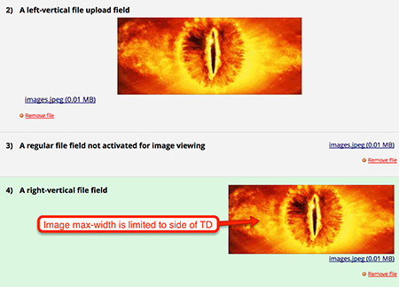
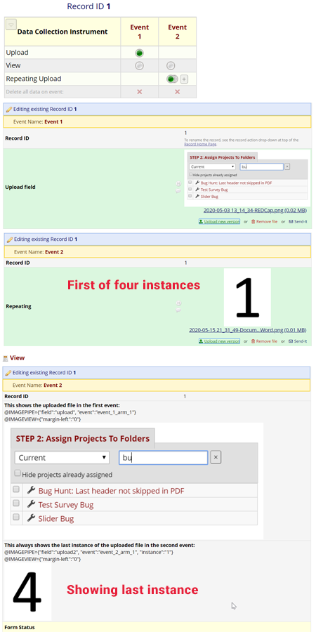

# Image Viewer

A REDCap External Modules that provides a preview of images and PDFs in file upload fields and allows piping of such previews into labels of other fields.

## Supported file types

- JPEG (.jpeg, .jpg, .jpe)
- GIF (.gif)
- PNG (.png)
- TIFF (.tif)
- BMP (.bmp)
- PDF (.pdf)

## Directions

- Enable the module on your server. If you wish to enable some logging, there is a server-setting to specify a log path.
- Enable the module on the projects where you wish to use the features of this module.
- Use the module configuration tool to select the preview fields.
- Alternately, you can use the @IMAGEVIEW action tag to specify fields to be previewed by editing the data dictinoary directly.
- Each field can be supplied with CSS paramaters to control formatting. For example, on a PDF upload field you might add a parameter of `{ "height": "400px" }`.
- If you are supplying custom formatting using the action tag, the format is: `@IMAGEVIEW={"height":"500px"}`
  - The format of the parameter string must be valid JSON (see https://jsonlint.com/)
  - In some cases, you might not be able to override the formatting if the parent table is constraining you.
  - If custom formatting is supplied both in an action tag and as part of the EM config page, the EM config page will take precedence.
  - The default size is to expand to the maximum width of the current table cell.
  - For right-vertical (Default) this means upto 50% but less if the image is smaller.
  - For left-vertical alignment this means the full width of the cell.
- To pipe an uploaded image or PDF into another field's label, use the `@IMAGEPIPE` action tag.
  - The parameter for this action-tag must be valid JSON, specifying the name of the source file upload or descriptive field alone, or together with event and/or instance:
  `@IMAGEPIPE="file_upload_field"`
  `@IMAGEPIPE={"field":"file_upload_field","event":123,"instance":1}`
  - Events can be specified by name or number.
  - Instances must be specified by number.
  - Smart Variables can be used for event and instance - specify as e.g. `{..., "instance":"[first-instance]"}`.

## Piping and Security

- Piped images or PDFs from forms the user (or survey participant) has no access to **will** be displayed.
- Security measures are in place that prevent unauthorized downloads.

## Examples

### Upload preview

### Piping

Consider the record structure in this example: Images are uploaded in both events. In the second event, the upload field is on a repeating form.
`View` is set up to show the file from the first event (`upload`) and the _last instance_ of the file from the second event (`upload2`).

## Changelog

Version | Description
------- | -------------------
1.4.5   | Updated framework to version 8 and updated library for pdfobject
1.4.4   | Minor bug fix on util logging class
1.4.3   | Added support for lowercase and fixed piping bugs (PR#6)
1.4.2   | Added REDCap minimal version requirement (9.7.8)
1.4.1   | Bug fixes (repeating events)
1.4.0   | Added support for image/PDF piping with the @IMAGEPIPE action-tag. Images are not part of the hyperlink any more.
1.3.2   | Supports embedding PDFs from descriptive fields as well.
1.3.1   | Made a minor fix in the ActionTag class that was calling an external class not included in the module.
1.3     | Added support for PDF files as well in addition to improving the preview of newly uploaded files.
1.2     | Bug fix in field specifications.
1.1     | Added support for custom action-tag @IMAGEVIEW.
1.0     | Initial release.
0.2     | Working and simplified version that is almost exclusively JavaScript.
