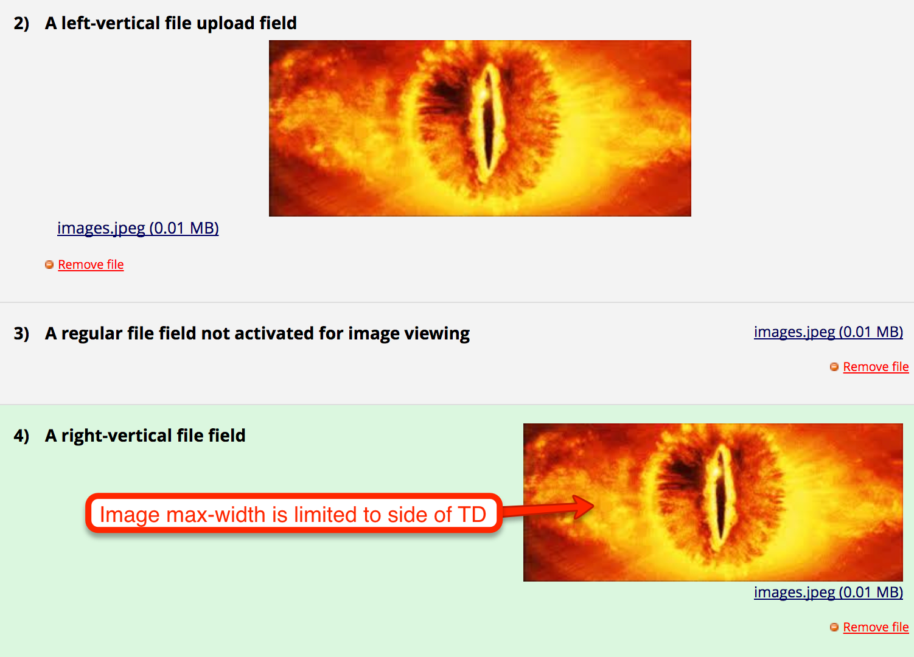

# redcap-em-image-viewer
This external module permits you to augment a file_upload field and allow a preview/display of files that are attached to these fields.

#### Features
 * Upload fields you want to enable preview on should be specified in the External Module configuration page
 * Only image files will be previewed
 * Image will appear at normal size unless larger than the cell in which case it will be shrunk.  Use the left-vertical format for larger images.
 * Action tags (@IMAGEVIEWER) will also trigger action to be backward compatible with Andy's old hook framework.
 
 
#### Example

 
 
*Last tested on v7.6.9*
 
 